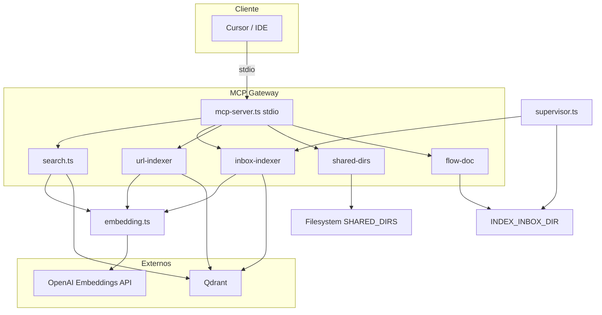

# Revisión exhaustiva: Arquitecto senior + Code review principal

**Proyecto:** MCP Knowledge Hub (gateway + indexación + búsqueda semántica).  
**Alcance:** Estructura, arquitectura, código, seguridad, operación y mejoras priorizadas.

---

## 1. Visión general de la arquitectura

**Resumen:** Servidor MCP por stdio que expone tools (search, count, index, list/read files, write flow docs). Indexación desde inbox + SHARED_DIRS + URLs; búsqueda en Qdrant con fallback keyword o semántica (OpenAI). Supervisor en bucle indexa inbox y shared dirs.

---

## 2. Fortalezas

| Área | Comentario |
|------|------------|
| **Separación de responsabilidades** | Módulos claros: embedding, chunking, search, inbox-indexer, url-indexer, shared-dirs, flow-doc. Cada uno con un propósito definido. |
| **Fallback sin OpenAI** | Si no hay `OPENAI_API_KEY`, el sistema sigue funcionando (keyword search, vector dummy). Buena degradación elegante. |
| **Chunking + batch** | Chunking por tamaño con overlap y batch upsert (50) reducen llamadas a API y a Qdrant. |
| **Identidad por (project, source_path)** | Evita colisiones entre proyectos/branches; `existsDocByProjectAndPath` bien usado. |
| **URLs: reindexación limpia** | Borrado por filtro `url` antes de insertar chunks nuevos evita duplicados al reindexar una URL. |
| **Documentación** | Checklist, sugerencias de indexación y diagrama HTML ayudan a onboarding y evolución. |
| **Configuración por env** | Variables centralizadas en `.env`; `.env.example` documenta opciones. |

---

## 3. Riesgos y problemas (priorizados)

### 3.1 Críticos

| # | Problema | Ubicación | Recomendación |
|---|----------|-----------|----------------|
| 1 | **API key en .env bajo repo** | `gateway/.env` | `.env` está en `.gitignore` (correcto). Asegurar que nunca se haga commit; considerar rotar la key si se compartió. No subir `.env` a remotos. |
| 2 | **VECTOR_SIZE evaluado al cargar el módulo** | `inbox-indexer.ts` L83, `url-indexer.ts` | `const VECTOR_SIZE = hasEmbedding() ? ...` se ejecuta cuando se carga el módulo. Si `dotenv/config` no se ha ejecutado antes (p. ej. otro entrypoint), podría ser 1 con key definida. | Usar función `getVectorSize()` que llame a `hasEmbedding()` en tiempo de ejecución, o garantizar en todos los entrypoints que dotenv se carga primero (ya es el caso en mcp-server y supervisor). |
| 3 | **Colección existente con size 1** | `ensureCollection` en inbox y url | Si la colección ya existe con `size: 1` y luego se configura la API key, no se recrea la colección; los inserts con vectores 1536 fallarían. | Documentado (borrar colección y reindexar). Opcional: en `ensureCollection`, si `hasEmbedding()` y la colección existe con `size !== EMBEDDING_DIMENSION`, lanzar error claro o ofrecer script de migración. |

### 3.2 Altos

| # | Problema | Ubicación | Recomendación |
|---|----------|-----------|----------------|
| 4 | **Cliente Qdrant creado por llamada** | `search.ts`, `inbox-indexer.ts`, `url-indexer.ts` | Cada función crea `new QdrantClient({ url })`. Sin pool, muchas conexiones bajo carga. | Introducir un singleton o factory de cliente Qdrant (y reutilizarlo en search, indexers, count, exists). |
| 5 | **existsDocByProjectAndPath con scroll** | `search.ts` | Para cada archivo en indexación se hace scroll con filtro (project + title). Con muchos puntos, puede ser lento y N round-trips. | Cargar una vez el set de (project, source_path) al inicio del ciclo (un scroll o count + scroll por lotes) y consultar en memoria; o indexar en payload y usar filter con índice. |
| 6 | **Sin reintentos ni timeout en OpenAI** | `embedding.ts` | Una sola llamada a `client.embeddings.create`; fallos de red o rate limit cortan el flujo. | Añadir retry con backoff (ej. 2–3 reintentos) y timeout configurable; en indexación, fallar el chunk/documento y continuar con el siguiente en lugar de romper todo el batch. |
| 7 | **Path traversal en readSharedFile / listSharedDir** | `shared-dirs.ts` | Se usa `path.join(root, relativePath)` y `path.resolve`; `isInsideRoot` comprueba que el resultado esté bajo `root`. | Correcto. Solo vigilar que `relativePath` no sea absoluto (ej. `/etc/passwd`) antes de unir; `path.join(root, '..', 'other')` ya se normaliza y `isInsideRoot` lo rechazaría. Revisar edge cases (symlinks fuera del root si el SO lo permite). |
| 8 | **MCP tools: schema con `as any`** | `mcp-server.ts` | Varios `{ ... } as any` en los schemas de tools. Pierde validación fuerte en runtime. | Sustituir por schemas Zod completos (o el formato que espere el SDK) y validar args antes de usar. |

### 3.3 Medios

| # | Problema | Ubicación | Recomendación |
|---|----------|-----------|----------------|
| 9 | **Indexación secuencial en processInboxItem** | `inbox-indexer.ts` | Para cada archivo/carpeta se llama `indexDocument` en serie; con embeddings, muchos archivos implican muchos awaits seguidos. | Paralelizar con límite de concurrencia (p-limit, ej. 5–10) por archivo o por batch de archivos, respetando rate limits de OpenAI. |
| 10 | **indexSharedDirs: un existsDocByProjectAndPath por archivo** | `inbox-indexer.ts` | Igual que (5): una llamada a Qdrant por archivo solo para comprobar si ya está indexado. | Pre-cargar set de (project, source_path) indexados (un scroll o endpoint) y filtrar en memoria. |
| 11 | **Sin métricas ni observabilidad** | Todo el gateway | No hay logs estructurados, métricas (latencia, errores, tokens usados) ni tracing. | Añadir logging con niveles (info/warn/error), opcionalmente métricas (contadores de indexados, búsquedas, fallos de embed) y, si se escala, OpenTelemetry o similar. |
| 12 | **Chunking solo por caracteres** | `chunking.ts` | No hay chunking por fronteras semánticas (p. ej. por función/clase en código). | Valorar, para código, heurísticos (regex por `class`/`function`) o umbral por tipo de archivo, como en SUGERENCIAS-INDEXACION.md. |
| 13 | **searchDocs: query vacía con embeddings** | `search.ts` | Si `query` está vacía pero `hasEmbedding()` es true, se cae al branch de scroll + keyword; no se usa vector. | Coherente. Opcional: si query vacía, devolver mensaje explícito o límite 0 en lugar de scroll. |
| 14 | **flow-doc: colisión de nombre de archivo** | `flow-doc.ts` | `flow-${slug}-${date}.md` puede colisionar si mismo título y fecha. | Añadir sufijo único (timestamp o UUID) o verificar existencia y numerar (flow-slug-date-2.md). |

### 3.4 Bajos

| # | Problema | Ubicación | Recomendación |
|---|----------|-----------|----------------|
| 15 | **Duplicación getInboxPath / getSharedRoots** | `inbox-indexer.ts`, `flow-doc.ts`, `shared-dirs.ts` | Lógica de env (INDEX_INBOX_DIR, SHARED_DIRS) repetida. | Extraer a módulo `config.ts` o `env.ts` (getInboxPath, getSharedDirsEntries, getQdrantUrl, etc.). |
| 16 | **Constantes mágicas** | Varios | 50 (batch), 2400/200/500 (chunk), 32_000 (embed truncate), 2 MB. | Centralizar en `constants.ts` o config con valores por defecto documentados. |
| 17 | **Tests** | `src/index.test.ts` existe; resto sin tests | Poca cobertura para search, embedding, chunking, indexers. | Añadir tests unitarios para chunking, embedding (mock), search (mock Qdrant), y al menos un test de integración opcional. |

---

## 4. Seguridad

| Aspecto | Estado | Nota |
|---------|--------|------|
| **Secrets** | Aceptable | API key y credenciales en env; `.env` en .gitignore. Evitar loguear env. |
| **Path traversal** | Aceptable | `shared-dirs.ts` normaliza y comprueba `isInsideRoot`. Revisar symlinks si el despliegue lo permite. |
| **Inyección / sanitización** | Bajo riesgo | Payloads a Qdrant son strings controlados; no hay HTML/scripting expuesto al usuario final. |
| **Rate limiting** | No implementado | MCP y HTTP (index.ts) no limitan requests. En producción, poner rate limit en el endpoint HTTP si se expone. |
| **Dependencias** | Revisar | `npm audit` reportó vulnerabilidades; valorar `npm audit fix` y actualizar deps con parches. |

---

## 5. Operación y despliegue

| Aspecto | Estado | Recomendación |
|---------|--------|----------------|
| **Health check** | Sí | `GET /health` en index.ts. Útil para orquestadores. |
| **Variables de entorno** | Documentadas en .env.example | Añadir OPENAI_API_KEY, OPENAI_EMBEDDING_MODEL y nota de borrar colección al activar embeddings. |
| **Primera ejecución con embeddings** | Colección nueva con size 1536 | Si ya existía mcp_docs con size 1, hay que borrarla y reindexar (documentado). |
| **Supervisor** | Bucle infinito con reintento tras fallo | Buena resistencia. Considerar límite de reintentos o alerta si falla N veces seguidas. |
| **Logs** | console.error / console.log | Estandarizar formato (JSON o texto con nivel y timestamp) para facilitar agregación. |

---

## 6. Coherencia y mantenibilidad

- **Naming:** Consistente en inglés (embed, chunkText, searchDocs) con payloads en snake_case (source_path, chunk_index) para Qdrant.
- **Tipado:** TypeScript con strict; algunos `Record<string, unknown>` y `as any` en MCP; mejorar tipado de payloads (interfaces) donde sea posible.
- **Idioma:** Comentarios y docs en español; código y nombres de funciones en inglés; buena mezcla para el equipo.
- **Duplicación:** getInboxPath, getSharedRoots, ensureCollection y constantes (QDRANT_URL, COLLECTION) repetidas; centralizar reduciría errores al cambiar config.

---

## 7. Mejoras priorizadas (roadmap sugerido)

**Fase 1 (corto plazo)**  
1. Cliente Qdrant singleton o factory.  
2. Reintentos + timeout en `embedding.ts`.  
3. Pre-carga de “ya indexados” (project, source_path) en indexación para reducir llamadas a existsDocByProjectAndPath.  
4. Eliminar `as any` en MCP tools y validar args con Zod.  
5. Centralizar config (env) y constantes.

**Fase 2 (medio)**  
6. Paralelismo controlado en indexación (inbox + shared dirs).  
7. Logging estructurado y opcionalmente métricas.  
8. Tests unitarios (chunking, embedding mock, search mock).  
9. Documentar y, si aplica, automatizar migración de colección (size 1 → 1536).

**Fase 3 (opcional)**  
10. Chunking por fronteras semánticas (código).  
11. Batch de embeddings (varios textos por llamada a OpenAI si el cliente lo soporta).  
12. Rate limiting en endpoint HTTP y opcionalmente en MCP.

---

## 8. Conclusión

El proyecto está bien estructurado para un MCP Knowledge Hub con indexación (inbox, shared dirs, URLs) y búsqueda semántica con fallback a keyword. Las decisiones de chunking, batch upsert y identidad por (project, source_path) son sólidas. Los principales puntos a atacar son: uso de cliente Qdrant compartido, robustez de llamadas a OpenAI (retry/timeout), reducción de round-trips en la indexación (pre-carga de existentes), y mejora de tipado/validación y observabilidad. Con las mejoras de Fase 1 y 2, el sistema queda listo para uso en equipo y despliegue más exigente.
