# Infraestructura MCP Knowledge Hub

Documento de referencia de la infraestructura actual del proyecto para presentación al equipo.

---

## Vista general

- **Entrada pública:** Nginx (puerto 80) en instancia EC2.
- **URL producción:** `http://mcp.domoticore.co` (solo HTTP).
- **Stack:** Docker Compose con PostgreSQL, Redis, Qdrant, InfluxDB, Grafana, Gateway (Node.js/TS), Supervisor, Webapp (Next.js), Nginx. Worker (Python) opcional con profile `jobs`.

---

## Diagrama de infraestructura (Mermaid)

```mermaid
flowchart TB
    subgraph usuarios["👥 Usuarios"]
        IDE["Cursor / IDE"]
        Browser["Navegador"]
    end

    subgraph ec2["🖥️ EC2 (52.91.217.181)"]
        subgraph proxy["Reverse proxy"]
            Nginx["Nginx :80"]
        end

        subgraph aplicaciones["Aplicaciones"]
            Webapp["Webapp (Next.js)\n:3000"]
            Gateway["Gateway MCP\n(Node.js + TS)\n:3001"]
            Supervisor["Supervisor\n(indexación cada 2 min)"]
            Worker["Worker (Python)\nprofile: jobs"]
        end

        subgraph datos["Datastores"]
            Postgres["PostgreSQL\n:5432\nmcp_hub"]
            Redis["Redis\n:6379"]
            Qdrant["Qdrant\n:6333"]
            InfluxDB["InfluxDB 2\n:8086"]
        end

        subgraph monitoreo["Monitoreo"]
            Grafana["Grafana\n:3002"]
        end
    end

    IDE -->|"stdio / MCP"| Gateway
    Browser -->|"http://mcp.domoticore.co"| Nginx
    Nginx -->|"/"| Webapp
    Nginx -->|"/api/*"| Gateway

    Webapp -->|"REST"| Gateway
    Gateway --> Qdrant
    Gateway --> Postgres
    Gateway --> InfluxDB
    Supervisor --> Qdrant
    Supervisor --> InfluxDB
    Worker --> Redis
    Worker --> Qdrant
    Worker --> Postgres
    Grafana --> InfluxDB
```

---

## Diagrama por capas (contenedores y puertos)

---

## Servicios Docker Compose

| Servicio     | Imagen / build     | Puerto host | Descripción |
|-------------|--------------------|-------------|-------------|
| **postgres** | postgres:15-alpine | 5432        | Base de datos relacional (metadata, trazabilidad, esquema `mcp_hub`). |
| **redis**   | redis:7-alpine     | 6379        | Cola de mensajes y cache. |
| **qdrant**  | qdrant/qdrant:v1.7.4 | 6333     | Base de datos vectorial (búsqueda semántica, colección `mcp_docs`). |
| **influxdb** | influxdb:2.7      | 8086        | Métricas (org/bucket configurables vía env). |
| **grafana** | grafana/grafana:11.1.4 | 3002   | Dashboards; fuente de datos InfluxDB. |
| **gateway** | build ./gateway    | — (3001 interno) | MCP Gateway: health, logs, upload, búsqueda, APIs. Depende de Postgres e InfluxDB. |
| **supervisor** | build ./gateway | —          | Indexa INDEX_INBOX y SHARED_DIRS cada 2 min. Depende de Qdrant e InfluxDB. |
| **worker**  | build ./worker     | —          | Jobs en background (Python, Celery/Redis). Perfil `jobs`. |
| **webapp**  | build ./webapp     | — (3000 interno) | Next.js: home, /upload, /files. |
| **nginx**   | build ./nginx      | 80          | Reverse proxy: `/` → webapp, `/api/` → gateway. |

---

## Rutas públicas (tras Nginx)

| Ruta           | Servicio | Descripción |
|----------------|----------|-------------|
| `/`            | Webapp   | Página principal, búsqueda. |
| `/upload`      | Webapp   | Subida a inbox/KB. |
| `/files`       | Webapp   | Explorador de archivos (raíz = FILES_EXPLORER_ROOT). |
| `/api/health`  | Gateway  | Health check. |
| `/api/search`  | Gateway  | Búsqueda (ej. `?q=docs`). |
| `/api/*`       | Gateway  | Resto de APIs (logs, upload, files/list, etc.). |

---

## Despliegue (EC2)

- **Host:** 52.91.217.181 (ec2-user).
- **Acceso:** SSH con clave `infra/mcp-server-key.pem`.
- **Proyecto en servidor:** `~/MCP-SERVER` (o `/home/ec2-user/MCP-SERVER`).
- **URL pública:** http://mcp.domoticore.co (solo HTTP).
- **Comandos típicos:** ver `docs/COMANDOS-INSTANCIA-EC2.md` (conexión, logs, docker compose, etc.).

---

## Volúmenes y datos persistentes

- **postgres_data**, **redis_data**, **qdrant_data**, **influxdb_data**, **grafana_data**, **gateway_data**.
- Carpetas montadas en gateway/supervisor: `INDEX_INBOX`, `USER_KB`, `classic`, `blueivory` (según compose).
- Worker monta `docs_repo` para documentación versionada.

---

## Desarrollo local (sin Docker completo)

- **Qdrant:** `docker run -d -p 6333:6333 qdrant/qdrant:v1.7.4`
- **Gateway:** `cd gateway && npm run build`; Cursor arranca MCP según `.cursor/mcp.json`.
- **Webapp:** `cd webapp && npm run dev` (puerto 3000 por defecto).
- **Supervisor (opcional):** `cd gateway && node dist/supervisor.js` o `--once`.

Variables relevantes en `gateway/.env`: `QDRANT_URL`, `INDEX_INBOX_DIR`, `SHARED_DIRS`, `FILES_EXPLORER_ROOT`. Para webapp: `NEXT_PUBLIC_GATEWAY_URL=http://localhost:3001`.

---

*Documento generado para presentación al equipo. Actualizado según README, docker-compose.yml, nginx.conf y docs del proyecto.*
