# MCP Knowledge Hub Infrastructure

Reference document for the current project infrastructure (team-facing).

---

## Overview

- **Public entrypoint**: Nginx (port 80) on an EC2 instance.
- **Production URL**: `http://mcp.domoticore.co` (HTTP only).
- **Stack**: Docker Compose with PostgreSQL, Redis, Qdrant, InfluxDB, Grafana, Gateway (Node.js/TS), Supervisor, Webapp (Next.js), Nginx. Optional Worker (Python) under the `jobs` profile.

---

## Infrastructure diagram (Mermaid)

```mermaid
flowchart TB
    subgraph usuarios["👥 Users"]
        IDE["Cursor / IDE"]
        Browser["Browser"]
    end

    subgraph ec2["🖥️ EC2 (52.91.217.181)"]
        subgraph proxy["Reverse proxy"]
            Nginx["Nginx :80"]
        end

        subgraph aplicaciones["Apps"]
            Webapp["Webapp (Next.js)\n:3000"]
            Gateway["Gateway MCP\n(Node.js + TS)\n:3001"]
            Supervisor["Supervisor\n(indexing every 2 min)"]
            Worker["Worker (Python)\nprofile: jobs"]
        end

        subgraph datos["Datastores"]
            Postgres["PostgreSQL\n:5432\nmcp_hub"]
            Redis["Redis\n:6379"]
            Qdrant["Qdrant\n:6333"]
            InfluxDB["InfluxDB 2\n:8086"]
        end

        subgraph monitoreo["Monitoring"]
            Grafana["Grafana\n:3002"]
        end
    end

    IDE -->|"stdio / MCP"| Gateway
    Browser -->|"http://mcp.domoticore.co"| Nginx
    Nginx -->|"/"| Webapp
    Nginx -->|"/api/*"| Gateway

    Webapp -->|"REST"| Gateway
    Gateway --> Qdrant
    Gateway --> Postgres
    Gateway --> InfluxDB
    Supervisor --> Qdrant
    Supervisor --> InfluxDB
    Worker --> Redis
    Worker --> Qdrant
    Worker --> Postgres
    Grafana --> InfluxDB
```

---

## Layered diagram (containers and ports)

---

## Docker Compose services

| Service     | Image / build     | Host port | Description |
|-------------|--------------------|-------------|-------------|
| **postgres** | postgres:15-alpine | 5432        | Relational DB (metadata, traceability, `mcp_hub` schema). |
| **redis**   | redis:7-alpine     | 6379        | Queue/cache. |
| **qdrant**  | qdrant/qdrant:v1.7.4 | 6333     | Vector DB (semantic search, `mcp_docs` collection). |
| **influxdb** | influxdb:2.7      | 8086        | Metrics (org/bucket configurable via env). |
| **grafana** | grafana/grafana:11.1.4 | 3002   | Dashboards; InfluxDB datasource. |
| **gateway** | build ./gateway    | — (internal 3001) | MCP Gateway: health, logs, upload, search, APIs. Depends on Postgres and InfluxDB. |
| **supervisor** | build ./gateway | —          | Indexes INDEX_INBOX and SHARED_DIRS every 2 min. Depends on Qdrant and InfluxDB. |
| **worker**  | build ./worker     | —          | Background jobs (Python, Celery/Redis). `jobs` profile. |
| **webapp**  | build ./webapp     | — (internal 3000) | Next.js: home, /upload, /files, /azure-tasks, /mcp-tools. |
| **nginx**   | build ./nginx      | 80          | Reverse proxy: `/` → webapp, `/api/` → gateway. |

---

## Public routes (behind Nginx)

| Route          | Service | Description |
|----------------|----------|-------------|
| `/`            | Webapp   | Home page (search). |
| `/upload`      | Webapp   | Upload to inbox/KB. |
| `/files`       | Webapp   | File explorer (root = FILES_EXPLORER_ROOT). |
| `/azure-tasks` | Webapp   | Azure work items UI. |
| `/mcp-tools`   | Webapp   | MCP tools catalog UI. |
| `/api/health`  | Gateway  | Health check. |
| `/api/search`  | Gateway  | Search (e.g. `?q=docs`). |
| `/api/*`       | Gateway  | Other APIs (logs, upload, files/list, etc.). |

---

## Deployment (EC2)

- **Host**: 52.91.217.181 (ec2-user).
- **Access**: SSH with key `infra/mcp-server-key.pem`.
- **Project on server**: `~/MCP-SERVER` (or `/home/ec2-user/MCP-SERVER`).
- **Public URL**: http://mcp.domoticore.co (HTTP only).
- **Public URL**: http://mcp.domoticore.co (HTTP only).
- **Common commands**: see `docs/COMANDOS-INSTANCIA-EC2.md` (connect, logs, docker compose, etc.).

---

## Volumes and persistent data

- **postgres_data**, **redis_data**, **qdrant_data**, **influxdb_data**, **grafana_data**, **gateway_data**.
- Folders mounted into gateway/supervisor: `INDEX_INBOX`, `USER_KB`, `classic`, `blueivory` (per compose).
- Worker mounts `docs_repo` for versioned documentation.

---

## Local development (without full Docker)

- **Qdrant**: `docker run -d -p 6333:6333 qdrant/qdrant:v1.7.4`
- **Gateway**: `cd gateway && npm run build`; Cursor starts MCP based on `.cursor/mcp.json`.
- **Webapp**: `cd webapp && npm run dev` (port 3000 by default).
- **Supervisor (optional)**: `cd gateway && node dist/supervisor.js` or `--once`.

Relevant variables in `gateway/.env`: `QDRANT_URL`, `INDEX_INBOX_DIR`, `SHARED_DIRS`, `FILES_EXPLORER_ROOT`. For the webapp: `NEXT_PUBLIC_GATEWAY_URL=http://localhost:3001` (local dev).

---

*Team-facing document. Updated based on README, docker-compose.yml, nginx.conf, and project docs.*
