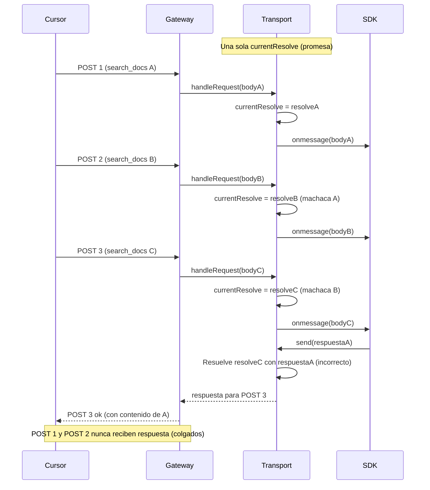
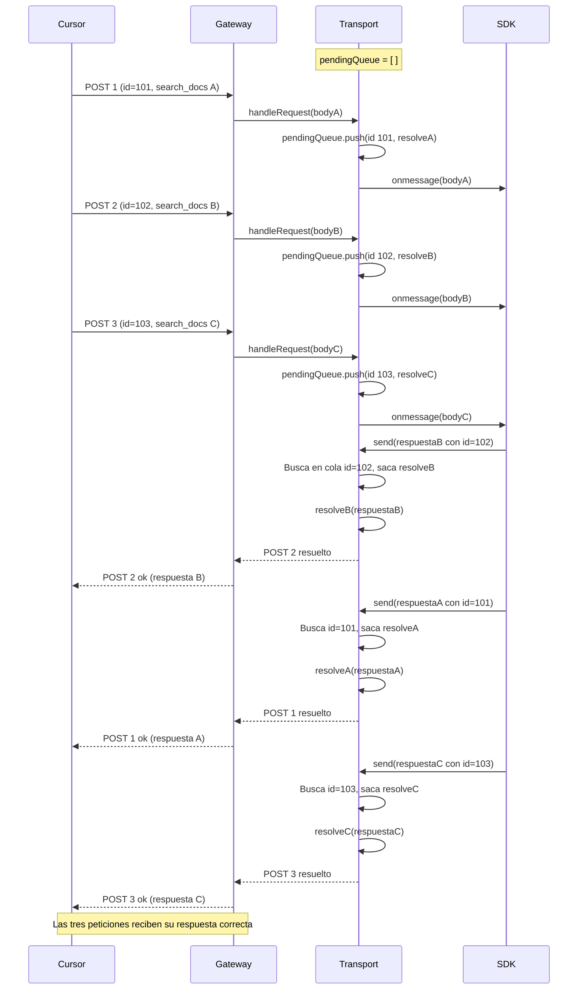
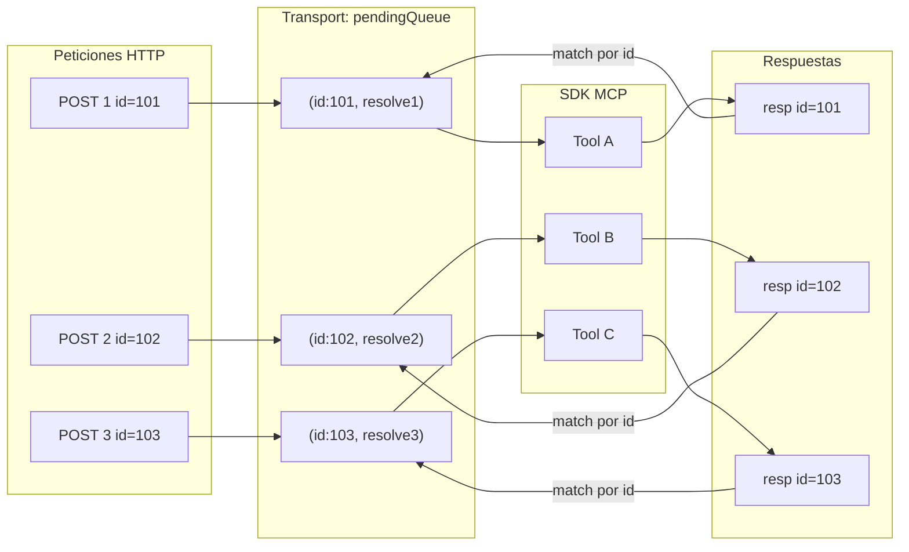

# Gráfico: solución al bloqueo de search_docs (MCP)

## El problema (antes)

Varias búsquedas en paralelo compartían **una sola promesa** en el transport. Solo la última petición HTTP recibía respuesta; las demás se quedaban colgadas.

---

## La solución (ahora)

Cada petición se guarda en una **cola** con su `id`. Cuando llega una respuesta, se empareja por `id` o, si no hay id, se asigna la más antigua (FIFO). Así cada POST recibe su respuesta.

---

## Resumen visual del transport

**Regla en `send(message)`:**

1. Si `message.id` existe → buscar en la cola la promesa con ese `requestId` y resolverla.
2. Si no hay `id` o no hay coincidencia → tomar la promesa más antigua (FIFO) y resolverla para no dejar peticiones colgadas.

---

## Logs de diagnóstico (lo que añadimos)

Para ver en producción si el emparejamiento funciona:

| Log | Qué indica |
|-----|------------|
| `mcp POST start` con `requestId` | Inicio de cada petición y su id JSON-RPC. |
| `mcp transport send resolve` con `matchedBy: "id"` | La respuesta se emparejó por id (correcto). |
| `mcp transport send resolve` con `matchedBy: "fifo"` | No había id en la respuesta; se usó la más antigua. |
| `mcp POST ok` / `mcp POST slow` con `requestId` | Fin de la petición; puedes correlacionar con el start. |

Si siempre ves `matchedBy: "fifo"`, el SDK no envía `id` en la respuesta pero las peticiones siguen recibiendo respuesta en orden (FIFO).
