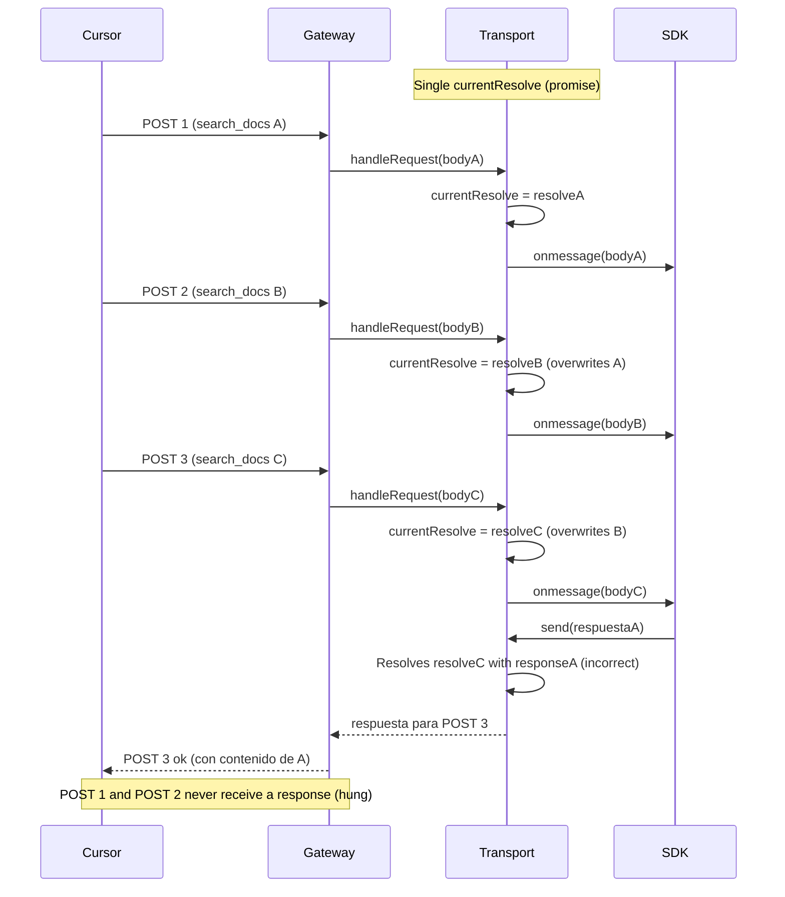
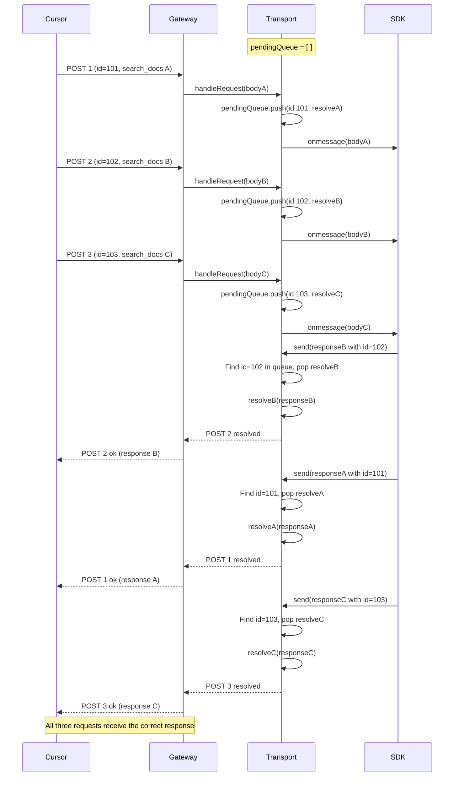
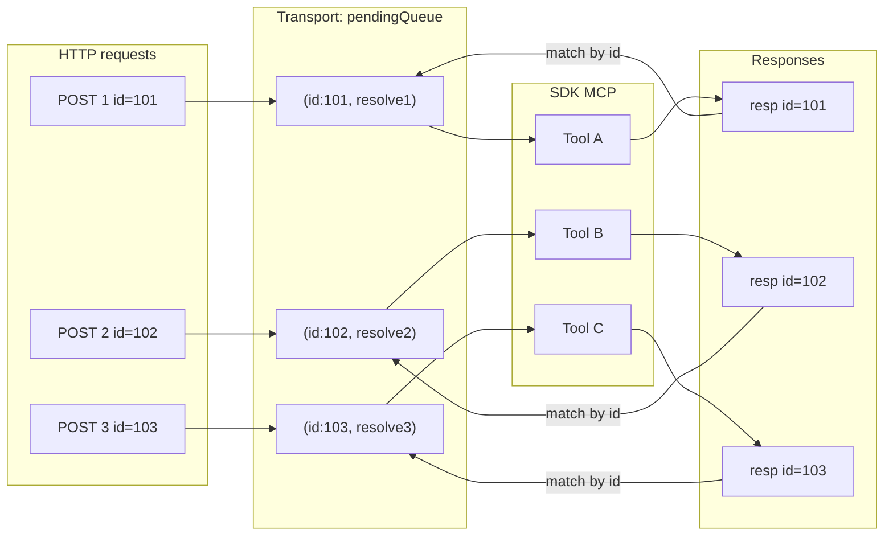

# Diagram: fix for `search_docs` hanging (MCP)

## The problem (before)

Multiple parallel searches shared **a single promise** in the transport. Only the last HTTP request got a response; the others would hang.

---

## The solution (now)

Each request is stored in a **queue** with its `id`. When a response arrives, it is matched by `id` or, if there’s no id, assigned to the oldest pending request (FIFO). This way each POST receives its own response.

---

## Transport visual summary

**Rule in `send(message)`:**

1. If `message.id` exists → find the queued promise with that `requestId` and resolve it.
2. If there’s no `id` or no match → take the oldest promise (FIFO) and resolve it to avoid leaving requests hanging.

---

## Step 4: Per-session queue in the gateway (serialization)

To ensure responses don’t cross even if the SDK doesn’t include an `id`, the gateway **serializes** requests per session: only one request at a time per `(userId, sessionId)`.

- Each POST /mcp goes into a per-session queue (`gateway/src/mcp/session-queue.ts`).
- `handleRequest` is called only when it’s that request’s turn; when it finishes, the next one is processed.
- Effect: tools/calls (multiple `search_docs`) run in order; each SDK `send()` corresponds to the in-flight request, so the transport assigns responses correctly (FIFO with only one pending at a time).

---

## Diagnostic logs (what we added)

To verify in production that matching works:

| Log | What it indicates |
|-----|------------|
| `mcp POST start` with `requestId` | Start of each request and its JSON-RPC id. |
| `mcp transport send resolve` with `matchedBy: "id"` | Response matched by id (correct). |
| `mcp transport send resolve` with `matchedBy: "fifo"` | No id in the response; the oldest pending request was used. |
| `mcp POST ok` / `mcp POST slow` with `requestId` | End of the request; you can correlate with the start. |

If you always see `matchedBy: "fifo"`, the SDK isn’t including `id` in responses, but requests still receive responses in order (FIFO).
